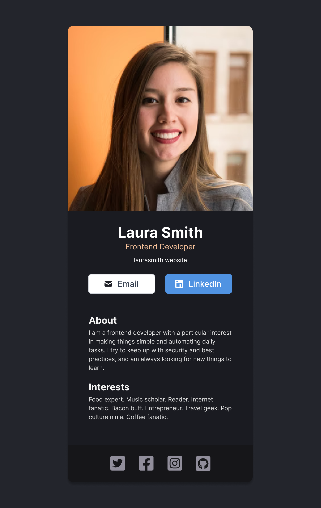

# Digital Business Card Solo Projects

## Design Spec

## Requirements
- Build from scratch
- Fill in own information
- Separate components for:
    - Info (photo, name, buttons, etc)
        - img
        - h1 name
        - h3 title
        - p website 
        - two buttons
            - email
            - linked in 
            - maybe add a github
    - About
        - h2 About title
        - p about paragraph 
    - Interests
        - h2 Interests title
        - p Interests paragraph
    - Footer (social icons)
        - different color
        - four icons
            - twitter
            - facebook
            - instagram
            - github
    
## [Figma file](https://www.figma.com/file/4ctPLUvIn5b5Ep6YPOZWWd/Digital-Business-Card?node-id=0-1&t=y9O7Qg3Q7vN5mxPL-0 )

